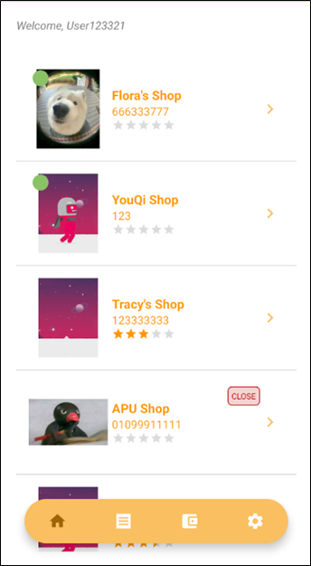
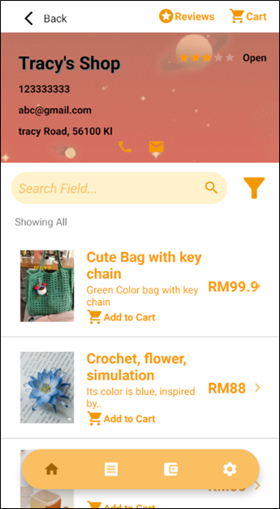
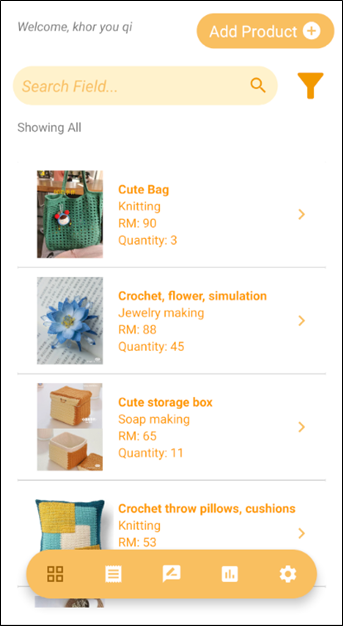

# Arti-Sun
**Arti-Sun** is a mobile application built using Java and Firebase that empowers Malaysian artisans, especially women and housewives, by providing a digital platform to sell handmade products. The app serves both buyers and sellers, supporting social and economic sustainability through the promotion of unique, high-quality handicrafts.

## 🛠 Features

### 🔐 Authentication
- Email-based registration & login
- Role-based access: Seller or Buyer
- Password reset via email

### 🛍 Buyer Features
- Browse shops and products
- Filter/search products by name and category
- Add items to cart, place orders, and view order history
- Write product and shop reviews
- View and top-up e-wallet (display-only feature)

### 🧵 Seller Features
- Upload, edit, and delete handmade products
- Manage orders with status updates
- View customer reviews and monthly reports
- Filter and search products and orders
- Update shop information and control visibility

### 🧪 Automated Testing
- Firebase Test Lab integration
- Robo test with UI crawling
- Performance and accessibility issue detection (e.g., touch target size, color contrast)

## 🧑‍💻 Tech Stack

- **Language**: Java
- **Database**: Firebase Realtime Database
- **Storage**: Firebase Storage
- **Authentication**: Firebase Auth
- **UI**: Android XML Layouts
- **Testing**: Firebase Test Lab
- **Libraries**:
  - Glide / Picasso (image loading)
  - AndroidEasySQL
  - CircularImageView

## 📸 Screenshots

| Buyer Home | Product Page | Seller Dashboard |
|------------|--------------|------------------|
| |  | |

## 🧪 Testing Insights

- ✅ Automated robo test on Pixel 3 API 28
- 🕒 Duration: 1m 21s
- ⚠️ 36 issues identified (14 warnings, 22 minor)
- Common issues: Low contrast text, touch target size

## 👩‍💻 Author

Khor You Qi  
[LinkedIn: khor-you-qi-tracy](https://www.linkedin.com/in/khor-you-qi-tracy/)
